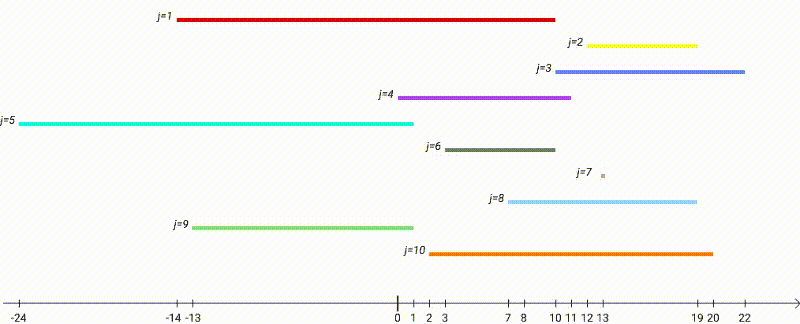
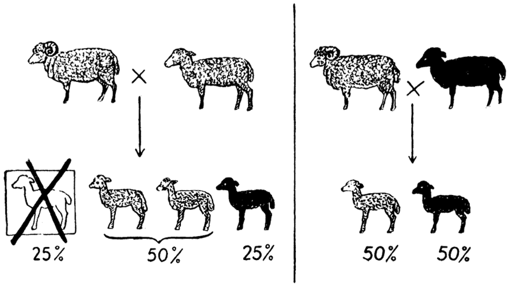
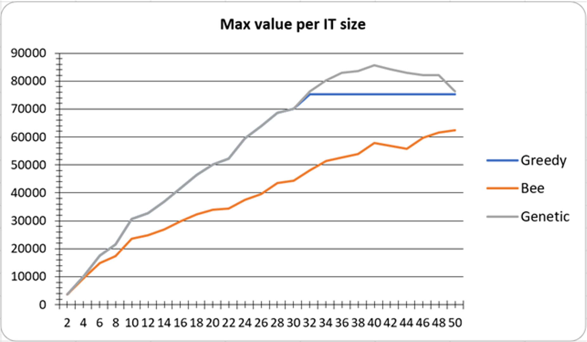
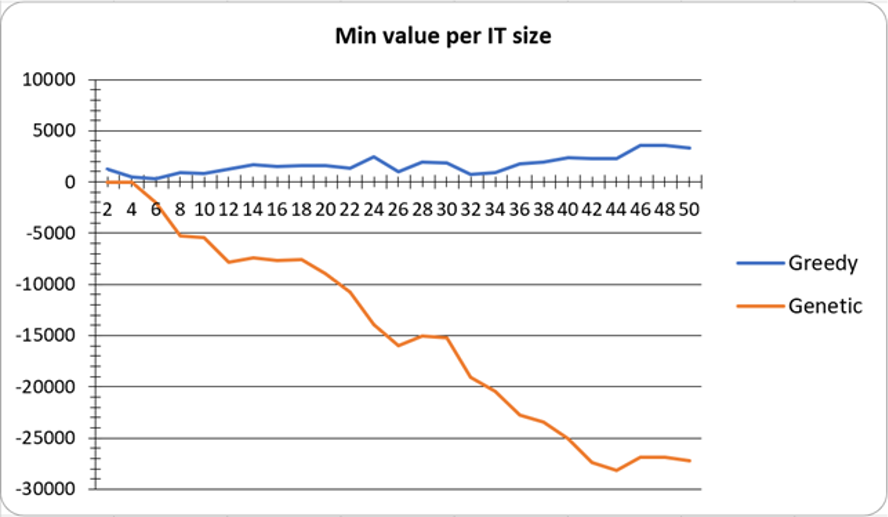
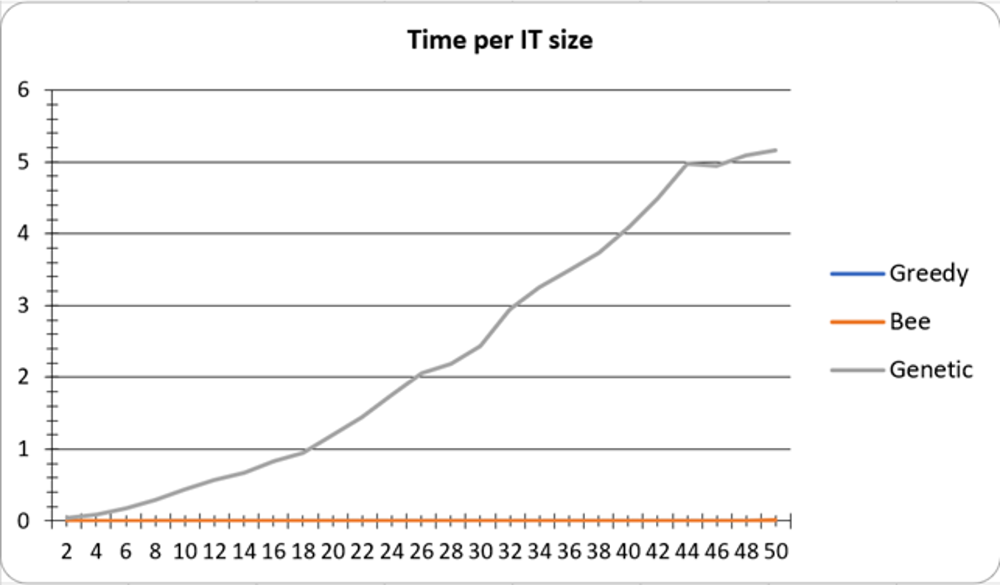

# 📘 Discrete Optimization Problem with Quadratic Objective Function

## 📌 Overview

This project presents the design, implementation, and experimental evaluation of algorithms for solving a **discrete optimization problem with a quadratic objective function**.

The work was completed as part of the course *Operations Research* at **Igor Sikorsky Kyiv Polytechnic Institute**.

**Students**:
- Oles Napadiy
- Viktoriia Vlasenko

The goal is to determine optimal values of decision variables under constraints such that a quadratic objective function reaches its **maximum or minimum**.

---

## 🧮 Problem Formulation

We consider a system with:

- **n integer variables** (n is even)  
- Each variable is bounded:  
  $a_j ≤ x_j ≤ b_j$
- Global constraint:  
  $sum (j=1..n) x_j ≤ B $
  
---

## 🎯 Objective Function

$$ x_1·x_2 + x_3·x_4 + ... + x(n-1)·x(n) → extremum $$

The task is to:

- **maximize** or **minimize** the objective function  
- while satisfying all constraints  

📄 See full formulation in the report.

---

## ⚙️ Implemented Algorithms

This project includes several optimization approaches:

---

### 🔹 Greedy Algorithm

- Iteratively assigns variable values based on constraints  
- Very fast and simple heuristic  
- Provides a **baseline solution**  

📉 Limitation: may get stuck in suboptimal solutions  

**Greedy Algorithm (for maximization) pseudo-code**

```raw
Repeat for each variable x_j (j = 1..n):

STEP 0:
Check if assigning the maximum possible value b_j
does not violate the constraint:
    current_sum + b_j ≤ B

STEP 1:
If yes:
    assign x_j = b_j

STEP 2:
Else:
    assign x_j the maximum possible value such that:
        current_sum + x_j ≤ B

STEP 3:
After all variables are assigned:
    compute the value of the objective function
```
**Greedy Algorithm (for minimization) pseudo-code**

```raw
Repeat for each variable x_j (j = 1..n):

STEP 0:
Check if assigning the minimum possible value a_j
does not violate the constraint:
    current_sum + a_j ≤ B

STEP 1:
Assign x_j = a_j

STEP 2:
After all variables are assigned:
    compute the value of the objective function
```

---

### 🐝 Bee Algorithm (with Local Search)



- Inspired by **swarm intelligence**
- Simulates:
  - scout bees (yellow bees) → exploration  
  - forager bees (blue bees) → exploitation  
- Includes:
  - random solution generation  
  - local improvement  
  - feasibility correction (“reanimation”)  

📌 **Time complexity:** $O(n · k)$, where *k* is the number of iterations  

**Bee Algorithm pseudo-code**

```raw
STEP 0:
Select regions (intervals) for searching solutions.

STEP 1:
Repeat until stopping criterion is met:

STEP 2:
Scout bees (blue bees on the scheme):
    explore positions randomly within selected regions

STEP 3:
Forager bees (blue beees; colored lines: green, purple, yellow, etc.):
    explore neighborhoods around promising positions found by scouts

STEP 4:
Select the best position in each region (green bees):
    (the most promising solution among explored ones)

STEP 5:
Check feasibility (read bees):
    if the new position violates constraints,
    move the bee to the nearest admissible position
    ("reanimation" step)

STEP 6:
Update the global best solution (record)

STEP 7:
Repeat the process
```
---

### 🧬 Genetic Algorithm



- Evolutionary optimization method  
- Based on:
  - selection (tournament)  
  - crossover (recombination)  
  - mutation  
  - local optimization  
  - population update  

Key features:

- Works with populations of solutions  
- Handles constraints via repair mechanism  
- Uses fitness function based on objective value  
- Strong global search capability  

**Genetic Algorithm pseudo-code**
```raw
STEP 0:
Generate an initial population of feasible solutions.

STEP 1:
Repeat until stopping criterion is met:

STEP 2:
Select parents for crossover
    (e.g., tournament selection)

STEP 3:
Apply crossover (recombination)
    to generate new offspring

STEP 4:
Apply mutation to offspring

STEP 5:
Repair solutions if constraints are violated

STEP 6:
Apply local optimization (optional)

STEP 7:
Form a new population
    (selection + replacement)

STEP 8:
Update the best solution (record)
    (maximum or minimum depending on the problem)
```
---

## 🧪 Experiments & Analysis

The algorithms were evaluated through multiple experiments:

### 🔍 Investigated factors:
- number of variables (problem size)  
- number of iterations  
- constraint parameter **B**  
- selection strategies (Genetic Algorithm)  
- impact of local optimization  

---

### 📊 Example Results

#### 🧪 Experiment 1: Influence of Problem Size (Maximization)



**Objective:**  
To analyze how the **problem size (number of variables n)** affects the value of the objective function.

**Setup:**
- Optimization type: **Maximization problem**
- Number of variables: $n ∈ {2, ..., 50}$
- Compared algorithms:
  - Greedy Algorithm
  - Bee Algorithm
  - Genetic Algorithm

**Measured parameter:**
- Objective function value

**Results:**
- The **Genetic Algorithm** achieves the highest objective values across all problem sizes
- The **Bee Algorithm** shows steady improvement but remains below the genetic approach
- The **Greedy Algorithm** quickly stabilizes and does not improve significantly for larger n

**Conclusion:**
The **Genetic Algorithm provides the best solution quality**, especially as the problem size increases, due to its ability to explore the global search space more effectively.

### 🧪 Experiment 1: Influence of Problem Size (Minimization)



**Objective:**  
To analyze how the **problem size (number of variables n)** affects the **minimum value** of the objective function.

**Setup:**
- Optimization type: **Minimization problem**
- Number of variables: $n ∈ {2, ..., 50}$
- Compared algorithms:
  - Greedy Algorithm
  - Genetic Algorithm

**Measured parameter:**
- Minimum value of the objective function

**Results:**
- The **Genetic Algorithm** consistently finds significantly lower (better) objective values
- The **Greedy Algorithm** produces relatively stable but suboptimal results
- As the problem size increases, the gap between the two algorithms becomes more pronounced

**Conclusion:**
The **Genetic Algorithm is more effective for minimization problems**, as it:
- better avoids local minima  
- explores the search space more thoroughly  
- produces higher-quality solutions for larger problem sizes

### 🧪 Experiment 1: Time Complexity Analysis



**Objective:**  
To analyze how the **problem size (number of variables n)** affects the **execution time** of different algorithms.

**Setup:**
- Number of variables: $n ∈ {2, ..., 50}$
- Compared algorithms:
  - Greedy Algorithm
  - Bee Algorithm
  - Genetic Algorithm

**Measured parameter:**
- Execution time

**Results:**
- The **Greedy Algorithm** shows very fast execution with minimal growth
- The **Bee Algorithm** demonstrates a **linear increase** in execution time as the problem size grows
- The **Genetic Algorithm** exhibits a **quadratic growth pattern**, with execution time increasing significantly for larger n

**Conclusion:**
- The **Greedy and Bee algorithms scale linearly** with problem size and are computationally efficient  
- The **Genetic Algorithm has higher computational cost**, but this is justified by its superior solution quality  

$ TODO Paste experiments 2-6
---

### 📈 Key Observations

- Solution quality improves with more iterations  
- Genetic algorithm consistently finds **better optima**  
- Bee algorithm provides **stable and balanced performance**  
- Greedy algorithm is fastest but least accurate  
- Constraint **B strongly affects feasibility and solution space**  

---

## 🧱 Project Structure

```
ConsoleApp1/
│
├── BeeAlgorithm.cs        # Bee algorithm implementation
├── GeneticAlgorithm.cs    # Genetic algorithm implementation
├── GreedyAlgorithm.cs     # Greedy algorithm
├── InputData.cs           # Input data generator
├── DataRecorder.cs        # Experiment logging
├── Report.cs              # Results processing
├── Program.cs             # Main entry point
├── ConsoleApp1.csproj     # Project configuration
```

---

## 🛠️ Technologies Used

* **C# (.NET 5.0)**
* Console application
* Custom algorithm implementations (no external ML libraries)

---

## 🎯 Key Features

* Multiple optimization algorithms in one project
* Support for both **minimization and maximization problems**
* Custom **input generator** for test cases
* Experimental comparison framework
* Clear algorithm implementations for educational purposes

---

## 📊 Conclusions

Based on the theoretical analysis and experimental evaluation of the developed algorithms, the following conclusions were obtained:

* The considered problem belongs to the class of **combinatorial optimization problems with constraints**, where finding an exact optimal solution is computationally expensive.

* The **Greedy Algorithm** provides fast results with low computational cost, but its solutions are often suboptimal due to its local decision-making nature.

* The **Bee Algorithm with Local Search** demonstrates:

  * good exploration of the search space
  * improved solution quality compared to greedy methods
  * stable performance across different problem sizes
  * effective balance between diversification and intensification

* The **Genetic Algorithm** showed the best overall performance:

  * consistently produces high-quality solutions
  * effectively explores the global search space
  * benefits significantly from:

    * selection strategy
    * mutation parameters
    * local optimization

* Experimental analysis confirmed that:

  * increasing the **number of iterations** improves solution quality but increases computation time
  * the constraint parameter **B** significantly affects the feasible solution space
  * **local optimization** noticeably improves final results for both Bee and Genetic algorithms
  * different **selection mechanisms** in the genetic algorithm impact convergence speed and accuracy

* In terms of complexity:

  * heuristic algorithms provide a practical trade-off between **accuracy and performance**
  * Bee Algorithm complexity is approximately $O(n \cdot k)$, where *k* is the number of iterations

* Overall:

  * **heuristic and evolutionary algorithms are effective approaches** for solving this class of problems
  * combining **global search (e.g., genetic algorithms)** with **local optimization techniques** yields the best results

